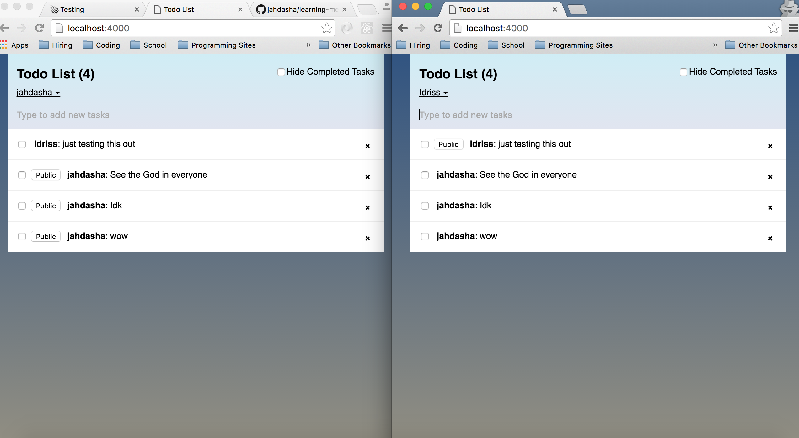
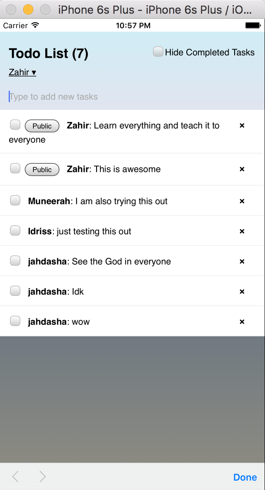
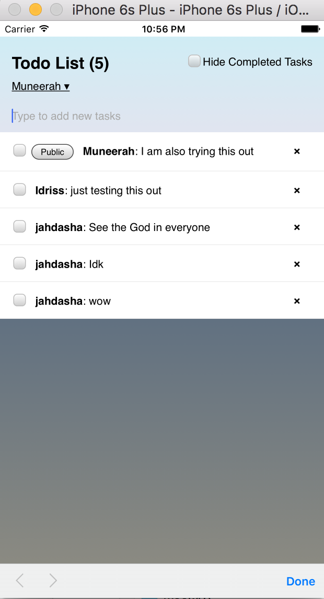

# Learning Meteor
## Simple Todo List

I use the The Meteor Tutorial app to create this.
You can access the site by following the [Meteor Tutorial](https://www.meteor.com/tutorials/react/creating-an-app).

Here is what the web app looks like.

Here is what the mobile app looks like.

Here is what the mobile app looks like.

